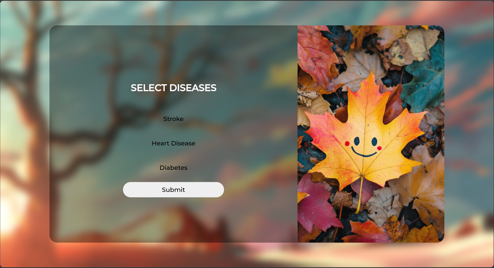
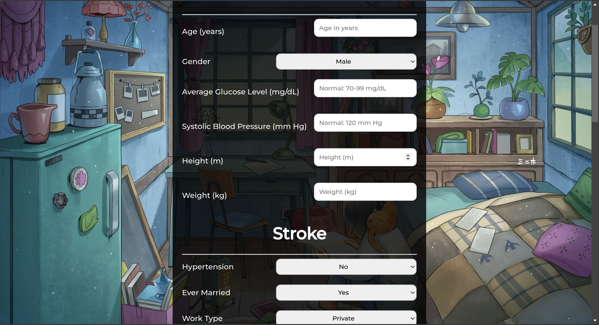
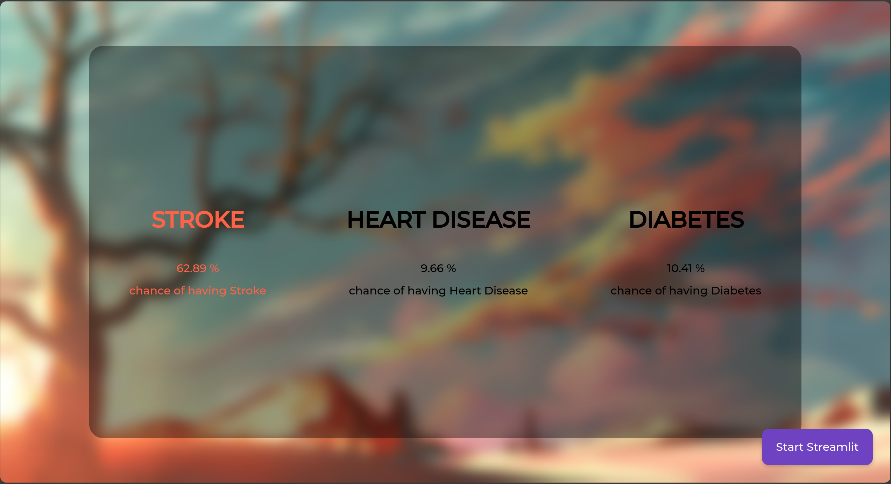

# RiskVision: Disease Risk Prediction

## Project Overview

RiskVision is a web application built using Flask that helps users assess their potential risk of contracting three common diseases: stroke, heart disease, and diabetes. It leverages machine learning models trained on data obtained from online sources (like Kaggle) to provide users with risk probabilities. Streamlit is used for model evaluation and more flexible prediction capabilities.

## Features

### Disease Prediction Interface (Flask)
- Interactive web interface for disease risk assessment
- Step-by-step questionnaire system
- Disease-specific and common feature grouping
- Real-time probability calculation using pre-trained models
- Support for multiple diseases:
  - Stroke
  - Heart Disease
  - Diabetes

### Model Evaluation Dashboard (Streamlit)
- Interactive model evaluation interface
- Support for multiple machine learning models:
  - Logistic Regression
  - Random Forest
  - Additional models
- Performance metrics visualization:
  - Accuracy
  - F1 Score
  - Recall
  - Additional metrics
- Flexible feature selection for predictions
- Live model training and evaluation

## Technology Stack

- **Backend Framework:** Flask
- **ML Libraries:** scikit-learn
- **Model Evaluation:** Streamlit
- **Model Persistence:** pickle
- **Data Sources:** Kaggle datasets


## Project Structure

```
RiskVision/
├── app.py                         # Main Flask app for disease prediction
├── Dockerfile                     # Dockerfile for containerizing the application
├── docker-compose.yml             # Docker Compose configuration file
├── requirements.txt               # Project dependencies
├── config/
│   ├── config.py                  # Configuration settings
│   ├── features.json              # Features metadata
│   └── __pycache__/               # Bytecode cache directory
├── data/
│   ├── model_training/            # Training data organized by disease
│   │   ├── diabetes/
│   │   ├── heart_disease/
│   │   └── stroke/
│   ├── processed/                 # Processed datasets
│   └── raw/                       # Raw datasets
├── models/                        # Trained models and scalers
│   ├── diabetes/
│   ├── heart_disease/
│   └── stroke/
├── notebooks/                     # Jupyter notebooks for EDA and model training
│   ├── diabetes/
│   ├── heart_disease/
│   ├── kidney_disease/
│   └── stroke/
├── static/                        # Static files for Flask
├── streamlit/                     # Streamlit app files for evaluation
├── templates/                     # HTML templates for Flask
├── tests/                        # Unit and integration tests
└── utils/                        # Utility scripts
```

## Screenshots

Here are some screenshots of the website:





## Installation

### Using Docker
1. Clone the repository:
   ```bash
   git clone https://github.com/yourusername/RiskVision.git
   cd RiskVision
   ```

2. Build the Docker images:
   ```bash
   docker compose build
   ```

3. Start the application:
   ```bash
   docker compose up
   ```

4. Access the Flask application:
   - Open your browser and navigate to `http://localhost:5000`.
   - Select a disease and follow the questionnaire.
   - View your risk assessment results.

5. Access the Streamlit dashboard:
   - keeping the previous terminal running.
   - Access the dashboard at `http://localhost:8501`.

### Direct Installation (without Docker)
1. Clone the repository:
   ```bash
   git clone https://github.com/yourusername/RiskVision.git
   cd RiskVision
   ```

2. Create and activate a virtual environment:
   ```bash
   python -m venv venv
   source venv/bin/activate  # On Windows: venv\Scripts\activate
   ```

3. Install dependencies:
   ```bash
   pip install -r requirements.txt
   ```

## Usage

### Flask Application
1. Start the Flask server:
   ```bash
   python app.py
   ```
2. Navigate to `http://localhost:5000` in your browser.
3. Select a disease and follow the questionnaire.
4. View your risk assessment results.

### Streamlit Dashboard
1. Navigate to the streamlit directory:
   ```bash
   cd streamlit
   ```
2. Run the Streamlit app:
   ```bash
   streamlit run app.py
   ```
3. Access the dashboard at `http://localhost:8501`.

## Model Training

- Models are trained using data from public datasets (Kaggle).
- Flask app uses pre-trained models (saved using pickle).
- Streamlit dashboard supports live model training and evaluation.
- Separate notebooks are available for each disease's model development.

## Acknowledgments

- Data sources from Kaggle.
- Open source community for various libraries used in this project.

## References
1. BUPA Medical Research Ltd. (1990). Liver Disorders Data Set [Data set]. UCI Machine Learning Repository. Retrieved from https://archive.ics.uci.edu/dataset/60/liver+disorders

2. Smith, J. (n.d.). Heart Disease Dataset [Data set]. Kaggle. Retrieved from https://www.kaggle.com/datasets/johnsmith88/heart-disease-dataset

3. Mathchi. (n.d.). Diabetes Data Set [Data set]. Kaggle. Retrieved from https://www.kaggle.com/datasets/mathchi/diabetes-data-set

4. Mansoor Daku. (n.d.). Chronic Kidney Disease Dataset [Data set]. Kaggle. Retrieved from https://www.kaggle.com/datasets/mansoordaku/ckdisease
